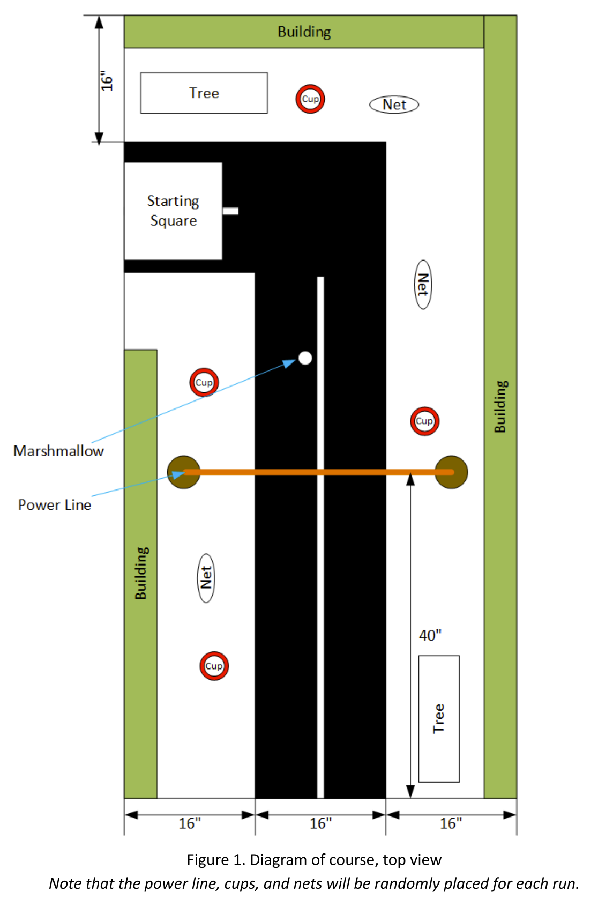
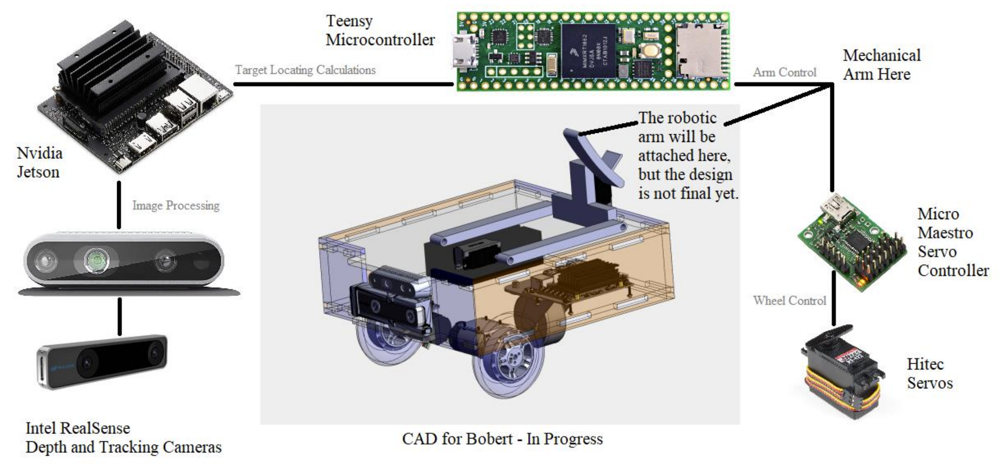
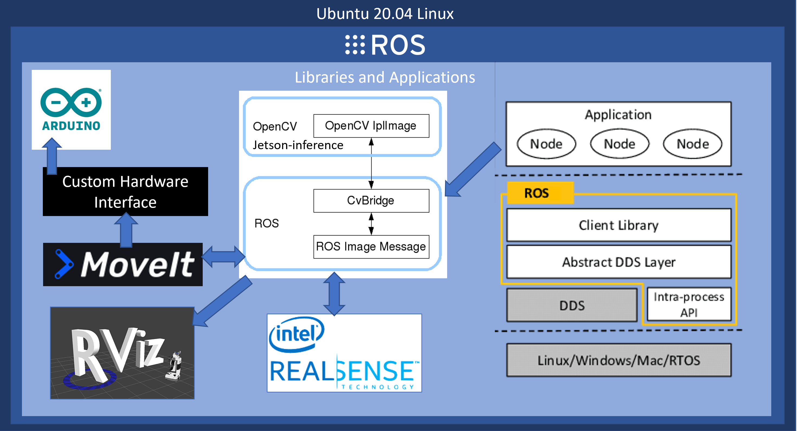
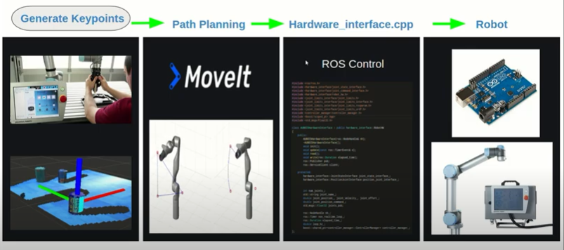
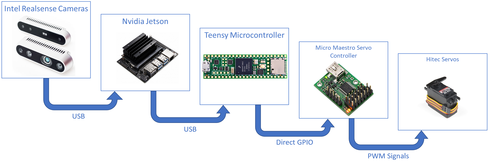

# SR-DEV-BOBERT
Team Mission Control's Repository for UF CpE Senior Design 2022
- Luke Rouleau
- Xuanhao Shi

## Table of Contents
1. [Design Goals](#design-goals)
2. [Architecture](#architecture)
   - [Hardware](#hardware-overview)
   - [Software](#software-overview)
3. [Testing](#testing)
4. [Alpha Build Specifications](#alpha-build-specifications)
5. [Repository Contents](#repository-contents)
   - [ROS Melodic Implemenation](./ROS_Melodic_Implementation)
     - **Active:** This is the current path of development. 
     - ROS Melodic is natively supported by the Nvidia Jetson Hardware, making development significantly more intuitive than using a containerized approach.
   - [ROS2+Docker Approach](./ROS2_Docker_Implementation)
     - **Depreciated:** This was a design attempt from which we've since pivoted away. 
   
   
## Design Goals
### Top-Level Goal:
The goal for our team, *Mission Control*, is to successfully program a robot named “Bobert”, designed and built by the *UF 
IEEE Hardware Team*, to compete at *IEEE SoutheastCon*.

### What are the objectives specified by the IEEE Southeast Con Competition?
The objective of the competition is to autonomously clear an L-shaped track, which models a city corner, of debris (i.e., a marshmallow placed somewhere on the road) and to remove Mardi Gras-style bead necklaces from "trees" and deposit them into plastic cups or throw them into nets. Most of the track remains static, but the location of the "trees" are random. View the [official competiton document](./docs/2022_SoutheastCon_HardwareRules-Final.pdf).
<p align="center">
   
</p>

### How does *Mission Control* plan to accomplish those goals?
Given the hardware provided, (a wheeled robotic platform, a Nvidia Jetson, Intel RealSense Depth and Tracking Cameras, and a servo-controlled 6 degree-of-freedom arm), we plan to connect the pieces of the autonomous robotic puzzle (perception, processing, actuation) with ROS Meloldic Middleware. What this really means is:
- [x] [Install ROS Melodic](http://wiki.ros.org/melodic/Installation/Ubuntu) on the Nvidia Jetson Nano
- [x] Install [Intel's drivers](https://github.com/IntelRealSense/librealsense/blob/master/doc/installation_jetson.md) to access the RealSense camera feeds inside of the /dev directory of Linux
- [x] Install the RealSense Wrappers and Nodes into the ROS underlay (application-generic library code visible to ROS):
  - ```sudo apt-get install ros-$ROS_DISTRO-realsense2-camera```
- [x] Create a ROS workspace in which a master node, camera nodes and topics, are created
  - Inside this repo, this workspace is the [./Ros_Melodic_Implementation/jetson_dev/cattkin_ws/](./Ros_Melodic_Implementation/jetson_dev/cattkin_ws/)
  - [Create unit tests](./PUT LINK HERE) to verify the proper spawning of all nodes and datafeeds
- [x] Use the [ROS control boilerplate](http://wiki.ros.org/ros_control_boilerplate) as the base for the overall control nodes and topics
- [ ] Employ SLAM, Mapping, and Navigation ROS packages for the competition environment. This is the most vague component until we have a robot to deploy our software on. Should be done within the next two weeks from the IEEE team.
- [x] Install and integrate the [MoveIt!](http://docs.ros.org/en/melodic/api/moveit_tutorials/html/doc/getting_started/getting_started.html) package on the OS
- [x] Set up a [RoboWare](https://github.com/TonyRobotics/RoboWare) envrionment for the workspace
- [x] Generate a URDF file for our 6 DOF robotic arm from a CAD model
  - Shown [here](./src/BobertLimits)
- [x] Use the MoveIt! [Setup Assistant](http://docs.ros.org/en/melodic/api/moveit_tutorials/html/doc/setup_assistant/setup_assistant_tutorial.html) to create configuration files to be used by the simulation
- [ ] Use MoveIt! to perform inverse kinematics on the arm when the wheeled platform is in a correct location
- [x] Write the Bobert control package
  - Shown [here](./src/bobert_control)
- [x] Write the simulation tests to test the control package
  - Included in the control package
- [ ] **Wheel-Servo Drivers:** Compose a custom hardware interface that reads from a ROS topic to convert the planned path to wheeled motion
- [ ] **Arm-Servo Driver:** Compose a custom hardware interface that reads from a ROS topic to control the 6DOF arm once the robot platform is near a "tree"
- [ ] Test Bobert inside of a replica course made by the IEEE Hardware Team
- [ ] Integrate the whole hardware interface to the Teensy

## Architecture
### Hardware Overview
1. Bobert's Mechanical Platform:
   - The form-factor is rectangular for ease and efficiency of mounting the rectangular internal components, the carriage is a tri-wheel design for maximal maneuverability  derived from a simple two-servo control scheme, and a top mounted arm for full range of motion above the robot body.
   - A 6DOF, servo-driven, [arm](https://www.amazon.com/diymore-Aluminium-Mechanical-Robotic-Arduino/dp/B01LW0LUPT/ref=asc_df_B01LW0LUPT/?tag=hyprod-20&linkCode=df0&hvadid=312031085430&hvpos=&hvnetw=g&hvrand=11766192266075412935&hvpone=&hvptwo=&hvqmt=&hvdev=c&hvdvcmdl=&hvlocint=&hvlocphy=9011703&hvtargid=pla-571106863858&psc=1)

2. Bobert's Electrical and Computational Hardware:
   - An [Intel RealSense T265 Tracking Camera](https://www.intelrealsense.com/tracking-camera-t265/)
   - An [Intel RealSense D435 Depth Camera](https://www.intelrealsense.com/depth-camera-d435/)
   - A [Nvidia Jetson Nano](https://developer.nvidia.com/embedded/jetson-nano-developer-kit) to perform image processing, running ROS, SLAM, path planning, inverse kinematics
   - A [Teensy Microcontroller](https://www.pjrc.com/store/teensy41.html) to drive the arm and wheel servos based on the ROS messages devlivered to it from the Jetson.
   
3. Hardware Component Relationship Diagram:
<p align="center">
   
</p>
 

### Software Overview
1. Tools Used & Their Purpose
   - Base OS:
     - [JetPack](https://developer.nvidia.com/embedded/jetpack): Which is Ubuntu 18.04, with modifications made by Nvidia to fully utilize the GPU on the Jetson Nano
   - Perception & Planning:
     - [Intel RealSense SDK](https://www.intelrealsense.com/sdk-2/): Exposes Open3D, TensorFlow, and OpenVINO packages, ROS Nodes, and install the hardware drivers for the T265 and D435 cameras 
     - [jetson-inference](https://github.com/dusty-nv/jetson-inference): Provides a Nvidia Deep-Learning API, which we will employ via transfer learning for object identification
   - Middleware: 
     - [ROS Melodic](http://wiki.ros.org/melodic/Installation/Ubuntu): Not really and OS, but a "glue" technology that manages and handles communication between robotic elements
   - Visualization and Simulation:
     - [Rviz](http://wiki.ros.org/rviz): a visualization tool to view complex data (spacial data), check component models. Used to answer the question, "What does the robot see?"
     - [Gazebo](http://gazebosim.org/): a simulation tool for "what should the robot see?" and "what should the robot do after seeing?". This tool is mainly used when physical testing/experimentation is not feasible, but we mostly plan to experiment in person on a mock track.
   - Modelling:
     - SolidWorks with URDF plug-in: a CAD program to create the CAD file and convert it to a URDF file for the robotic arm 
   - Inverse Kinematics:
     - [MoveIt](https://moveit.ros.org/): a tool that, given a URDF file for an arm, performs inverse kinematics, and motion planning for the robotic arm
   - Development Environemnt: 
     - [RoboWare](https://github.com/tonyrobotics/roboware-studio): an open-source IDE to set up the envrionment and organize all the source code (cfg files, include files, launch files, msg files, src files, CMakeLists, packages, etc.)
     
2. Software Component Relationship Diagram
   - Development tools that are present on desktop devices but not on the Nvidia Jetson (i.e. Gazebo, RoboWare) are excluded:
<p align="center">
   
</p>
   - Arm control sub-system diagram:
<p align="center">
   
</p>
3. Interfaces
   - Black Box Diagram:
<p align="center">
   
</p>   
   - Networking Diagram:
<p align="center">
   
</p>

### Responsibilities
#### NOTE: 
This repo, SR-DEV-BOBERT, serves as a central location of our software for the robot; HOWEVER, it has only been committed to by LUKE. Since, at this stage of development, the tasks XUANHAO and LUKE are working on are disjointed, we have **two separate repositories**, so individual contributions would not get muddled together. All of Xuanhao's work is present in this repo, but LUKE cloned his repo to his machine, copied it into this repo, and merged it. Thus, **the "paper trail" of this repo looks like only LUKE has contributed, and this is false**. 
- **XUANHAO is responsible for** all the code [HERE](./ROS_Melodic_Implementation/roboware_ros_ws/) (located inside this repo), or [HERE](https://github.com/x15000177/bobert_ws) (XUANHAO'S actual individual repo) 
  - XUANHAO'S "paper trail" is indicated by the commit history to [his reposity](https://github.com/x15000177/bobert_ws)   
  - MoveIt! installation and [simulation config file creation](https://github.com/x15000177/bobert_ws/blob/main/src/bobert_moveit_config)
  - Creation of the [URDF file](https://github.com/x15000177/bobert_ws/blob/main/src/bobert_moveit_config) necessary to model in MoveIt!
  - Make the workspace RoboWare compatible
  - Write the ROS control namespace (ros_control) and simulation test to verify the [control package](https://github.com/x15000177/bobert_ws/blob/main/src/bobert_control)
- **LUKE is reponsible for** all of the remaining aspects of this repository, like the (now depreciated) [ROS2 Docker Implementation](./ROS2_Docker_Implementation/), and the [jetson_dev](./ROS_Melodic_Implementation/jetson_dev/) folder inside of the (active) [ROS Melodic Implementation](./ROS_Melodic_Implementation/)
  - Preparation of the Nvidia Jetson Environment (Jetpack flashing, ROS install)
  - Integration of the RealSense Cameras (driver, SDK, and ROS package install)
  - Installation and building of [jetson_inference](https://github.com/LukeRouleau/SR-DEV-BOBERT/tree/main/ROS_Melodic_Implementation/jetson_dev/jetson_inference) models for future transfer learning to identify our targets  
  - Creation the ROS scan/perception namespace (the nodes related to sensor input)
  - Connecting perception (RealSense Cameras) to ROS and verification of message passing
  - **Next Major Task:** Developing the SLAM namespace (ros_mapping), the navigation namespace (ros_navigation), and connecting this to the base boilerplate (ros_base) in development by Xuanhao.  


## Testing
Xuanhao's Test node, my rostest and test script
Create metrics for a physical robot's performance

## Alpha Build Specifications
- Usability
  - Interface
  - Navigation
  - Perception
  - Responsiveness 
- Build Quality
  - Robustness
  - Consistency
  - Aesthetic Rigor 
- Vertical Features
  - External Interface
  - Persistent State
  - Internal Systems 


# Repository Contents
## [Native ROS Melodic Implementation](./ROS_Melodic_Implementation)  
Based entirely off of [Nvidia's example](https://github.com/dusty-nv/jetbot_ros/tree/melodic)

### Goal:
Create a ROS-running autonomous robot powered by the Nvidia Jetson. Since the Jetson runs Ubuntu 18, ROS Melodic runs natively! Yay!
### Steps Taken [as of Alpha Build 1/21/22]:
- Install ROS Melodic (Desktop-Full install) onto the Nvidia Jetson 
- Install Gazebo for ROS Melodic
- Install the RealSense Library & Wrappers for ROS Melodic
- Create a [Roboware](http://wiki.ros.org/IDEs#RoboWare_Studio) IDE compatible [workspace](./ROS_Melodic_Implementation/roboware_ros_ws/)
- Built [jetson-inference](https://github.com/dusty-nv/jetson-inference), Nvidia's DNN repository for the Jetson Platform, onto the Jetson.
- Built the [ROS Melodic Nodes](https://github.com/dusty-nv/ros_deep_learning) to interact with **jetson-inference** from our cameras.
- [Connect the RealSense D435 and T265 cameras to the ROS environment, spawn their nodes.](./ROS_Melodic_Implementation/jetson_dev/images/d435_and_t265_rosgraph.png)
- Connect the camera input to Rviz (click image for video):

 [](https://www.youtube.com/watch?v=0Snpj9SjjzQ)


## [DEPRECIATED!: ROS2-Docker Implementation](./ROS2_Docker_Implementation)
Based entirely off of [Nvidia's example](https://github.com/dusty-nv/jetbot_ros)

### Goal:
Create a ROS2-running robot powered by the Nvidia Jetson. Since the Jetson runs Ubuntu 18, use docker containers to accomplish this.
### Steps Taken [as of Alpha Build 1/21/22]:
- Create a [Dockerfile](./ROS2_Docker_Implementation/Dockerfile) to build a custom container to our specs.
- Test the docker container, try to start a Gazebo World. **Failure, detailed below.**

### Issues Present [as of Alpha Build 1/21/22]:
- Though we can successfully build a ROS2 Foxy container with Gazebo and Python 3 Bindings for Gazebo, Gazebo ALWAYS hangs on launch, like seen [here](./ROS2_Docker_Implementation/imgs/gazebo_hang.jpeg).
- We cannot escape the feeling that we are trying to stick a round peg into a square hole with trying to run ROS2 on the Jetson. 
  - **It might be time to fallback to ROS. - Luke, 1/17/22**
