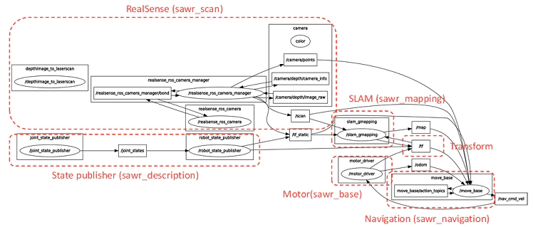
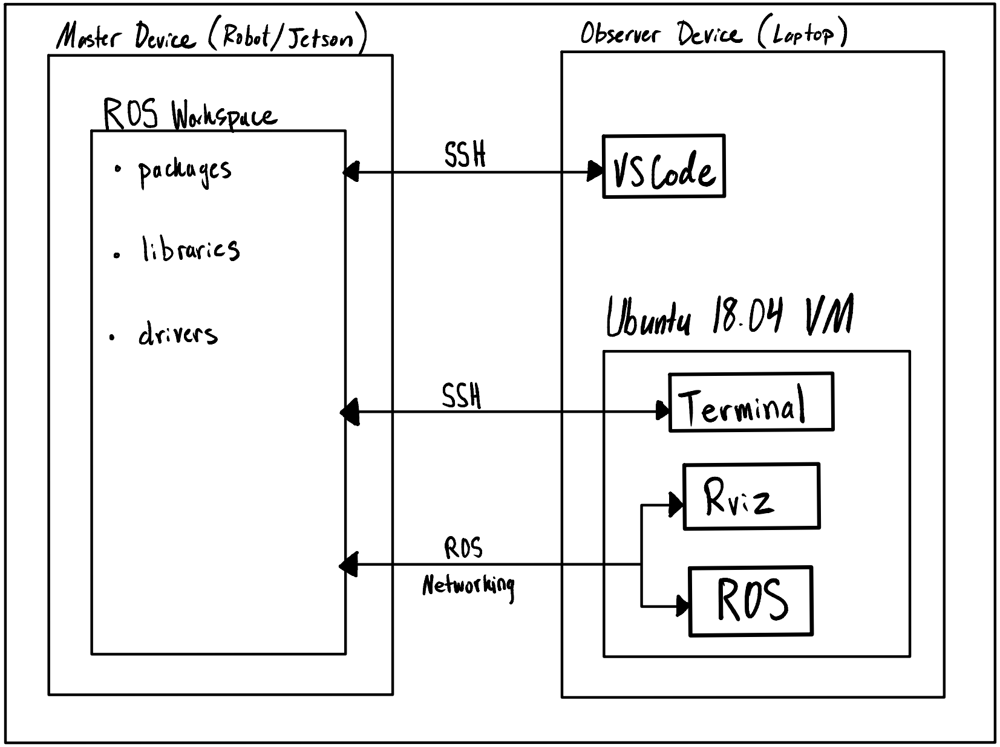
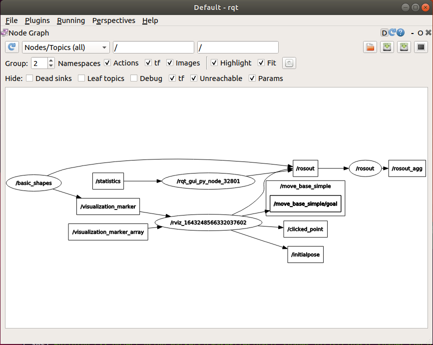
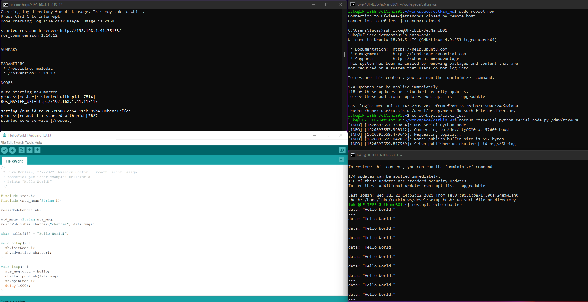
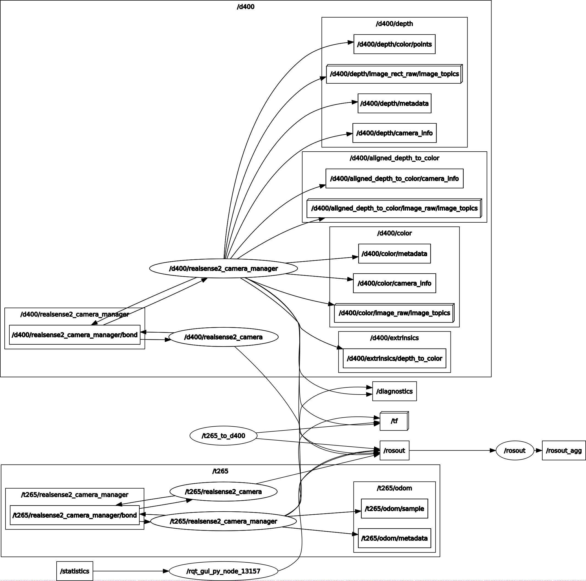
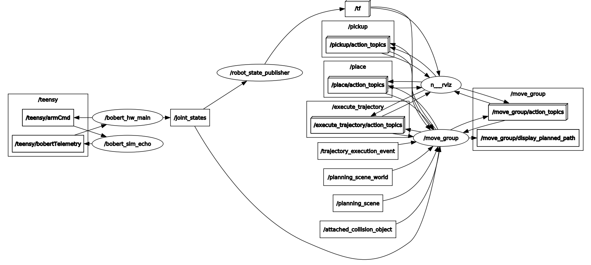

# SR-DEV-BOBERT
Team Mission Control's Repository for UF CpE Senior Design 2022; URL: https://github.com/LukeRouleau/SR-DEV-BOBERT
- Luke Rouleau
- Xuanhao Shi

## Table of Contents
1. [Repository Contents](#repository-contents)
   - [ROS Melodic Implemenation](./ROS_Melodic_Implementation)
     - **Active:** This is the current path of development. 
   - [ROS2+Docker Approach](./ROS2_Docker_Implementation)
     - **Depreciated:** This was a design attempt from which we've since pivoted away. 
2. [Design Goals](#design-goals)
3. [Architecture](#architecture)
   - [Hardware](#hardware-overview)
   - [Software](#software-overview)
4. [Individual Responsibilities](#responsibilities)
5. [Unit Testing](#unit-testing)
6. [~~Alpha~~ Beta Build Specifications](#alpha-beta-build-specifications)
7. [Alpha Test Report](#alpha-test-report)
8. [Progress Log](#progress-log)
   
## Repository Contents
1. [Native ROS Melodic Implementation](./ROS_Melodic_Implementation)  
Code here represents the current branch of development. ROS Melodic is natively supported by the Nvidia Jetson Hardware, making development significantly more intuitive than using a containerized approach. It includes two subdirectories:
   1. [jetson_dev](./ROS_Melodic_Implementation/jetson_dev/): LUKE'S Responsibilities, the Jetson setup and ROS perception elements
   2. [roboware_ros_ws](./ROS_Melodic_Implementation/roboware_ros_ws/): XUANHAO'S Responsibilities, the hardware interface, servo drivers, and arm control
   3. [rviz_demo_ws](./ROS_Melodic_Implementation/rviz_demo_ws/): LUKE'S Responsibilities, the test workspace used to verify the remote development and visualization connection
   4. [teensyduino](./ROS_Melodic_Implementation/teensyduino/): LUKE'S & XUANHAO'S Responsibilities, the Arduino sketches to be programmed on the Teensy 
2. [DEPRECIATED!: ROS2-Docker Implementation](./ROS2_Docker_Implementation)
Code here is a remnant from the attempt made to dockerize ROS2 Foxy on the Jetson. We bit off more than we could chew with this, and as of 1/17/21, everything in this dirctory is no longer active nor will be added to in the future.

## Design Goals
### Top-Level Goal:
The goal for our team, *Mission Control*, is to successfully program a robot named “Bobert”, designed and built by the *UF 
IEEE Hardware Team*, to compete at *IEEE SoutheastCon*.

### What are the objectives specified by the IEEE Southeast Con Competition?
The objective of the competition is to autonomously clear an L-shaped track, which models a city corner, of debris (i.e., a marshmallow placed somewhere on the road) and to remove Mardi Gras-style bead necklaces from "trees" and deposit them into plastic cups or throw them into nets. Most of the track remains static, but the location of the "trees" are random. View the [official competiton document](./docs/2022_SoutheastCon_HardwareRules-Final.pdf).
<p align="center">
   
</p>

### How does *Mission Control* plan to accomplish those goals?
Given the hardware provided, (a wheeled robotic platform, a Nvidia Jetson, Intel RealSense Depth and Tracking Cameras, and a servo-controlled 6 degree-of-freedom arm), we plan to connect the pieces of the autonomous robotic puzzle (perception, processing, actuation) with ROS Meloldic Middleware. What this really means is:
- [x] [Install ROS Melodic](http://wiki.ros.org/melodic/Installation/Ubuntu) on the Nvidia Jetson Nano
- [x] Install [Intel's drivers](https://github.com/IntelRealSense/librealsense/blob/master/doc/installation_jetson.md) to access the RealSense camera feeds inside of the /dev directory of Linux
- [x] Install the RealSense Wrappers and Nodes into the ROS underlay (application-generic library code visible to ROS):
  - ```sudo apt-get install ros-$ROS_DISTRO-realsense2-camera```
- [x] Create a ROS workspace in which a master node, camera nodes and topics, are created
  - Inside this repo, this workspace is the [./Ros_Melodic_Implementation/jetson_dev/cattkin_ws/](./ROS_Melodic_Implementation/jetson_dev/catkin_ws/)
  - [Create unit tests](./PUT LINK HERE) to verify the proper spawning of all nodes and datafeeds
- [x] Use the [ROS control boilerplate](http://wiki.ros.org/ros_control_boilerplate) as the base for the overall control nodes and topics
- [x] Setup a remote develoment environment (Set up the Jetson for wifi and running in headless mode, ssh into it and setup ROS networking)
- [x] Test remote Rviz visualization 
- [x] Employ SLAM ROS packages for the competition environment
   - [x] Use the RealSense T265 Tracking Camera to perform SLAM
   - [x] Write a ROS package to generate a 2D occupancy map based off 3D Depth images and T265 SLAM. This package is called [occupancy](./ROS_Melodic_Implementation/jetson_dev/catkin_ws/src/occupancy/).
- [ ] Compose a ROS package off of the standard ROS navigation software stack that takes the 2D occupancy map and a target-trained network and performs path planning
- [x] Install and integrate the [MoveIt!](http://docs.ros.org/en/melodic/api/moveit_tutorials/html/doc/getting_started/getting_started.html) package on the OS
- [x] Set up a [RoboWare](https://github.com/TonyRobotics/RoboWare) envrionment for the workspace
- [x] Generate a URDF file for our 6 DOF robotic arm from a CAD model
  - Shown [here](./src/BobertLimits)
- [x] Use the MoveIt! [Setup Assistant](http://docs.ros.org/en/melodic/api/moveit_tutorials/html/doc/setup_assistant/setup_assistant_tutorial.html) to create configuration files to be used by the simulation
- [x] Use MoveIt! to perform inverse kinematics on the arm when the wheeled platform is in a correct location
- [x] Write the Bobert control package
  - Shown [here](./src/bobert_control)
- [x] Write the simulation tests to test the control package
  - Included in the control package
- [x] Use ```rosserial``` to connect the Jetson and Teensy via UART over USB [WIKI](http://wiki.ros.org/rosserial_arduino) [GITHUB](https://github.com/ros-drivers/rosserial)
- [x] **Wheel-Servo Drivers:** Compose a hardware interface that reads the ROS node on the Teensy and executes the velocity commands. Also, feed the odometery information back to the T265 for more robust SLAM.
- [ ] **Arm-Servo Driver/Interface:** Compose a custom hardware interface that reads from a ROS topic to control the 6DOF arm once the robot platform is near a "tree"
- [ ] Using the custom made URDF file, get the arm simulation working so that we can test the custom arm hardware interface
   - [x] Reached out to Max Panoff, our TA in Autonomous Robotics, to receive aid the in the debugging of the arm simulation
- [ ] Test Bobert inside of a replica course made by the IEEE Hardware Team


## Architecture
### Hardware Overview
1. Bobert's Mechanical Platform:
   - The form-factor is rectangular for ease and efficiency of mounting the rectangular internal components, the carriage is a tri-wheel design for maximal maneuverability  derived from a simple two-servo control scheme, and a top mounted arm for full range of motion above the robot body.
   - A 6DOF, servo-driven, [arm](https://www.amazon.com/diymore-Aluminium-Mechanical-Robotic-Arduino/dp/B01LW0LUPT/ref=asc_df_B01LW0LUPT/?tag=hyprod-20&linkCode=df0&hvadid=312031085430&hvpos=&hvnetw=g&hvrand=11766192266075412935&hvpone=&hvptwo=&hvqmt=&hvdev=c&hvdvcmdl=&hvlocint=&hvlocphy=9011703&hvtargid=pla-571106863858&psc=1)

2. Bobert's Electrical and Computational Hardware:
   - An [Intel RealSense T265 Tracking Camera](https://www.intelrealsense.com/tracking-camera-t265/)
   - An [Intel RealSense D435 Depth Camera](https://www.intelrealsense.com/depth-camera-d435/)
   - A [Nvidia Jetson Nano](https://developer.nvidia.com/embedded/jetson-nano-developer-kit) to perform image processing, running ROS, SLAM, path planning, inverse kinematics
   - A [Teensy Microcontroller](https://www.pjrc.com/store/teensy41.html) to drive the arm and wheel servos based on the ROS messages devlivered to it from the Jetson via ```rosserial```.
   
3. Hardware Component Relationship Diagram:
<p align="center">
   
</p>

- Wired Connection Diagram:
<p align="center">
   
</p>
 

### Software Overview
1. Tools Used & Their Purpose
   - Base OS:
     - [JetPack](https://developer.nvidia.com/embedded/jetpack): Which is Ubuntu 18.04, with modifications made by Nvidia to fully utilize the GPU on the Jetson Nano
   - Perception & Planning:
     - [Intel RealSense SDK](https://www.intelrealsense.com/sdk-2/): Exposes Open3D, TensorFlow, and OpenVINO packages, ROS Nodes, and install the hardware drivers for the T265 and D435 cameras 
     - [jetson-inference](https://github.com/dusty-nv/jetson-inference): Provides a Nvidia Deep-Learning API, which we will employ via transfer learning for object identification
   - Middleware: 
     - [ROS Melodic](http://wiki.ros.org/melodic/Installation/Ubuntu): Not really and OS, but a "glue" technology that manages and handles communication between robotic elements
     - [rosserial](http://wiki.ros.org/rosserial_arduino): rosserial is a protocol for wrapping standard ROS serialized messages and multiplexing multiple topics and services over a character device such as a serial port or network socket
     - [realsense-ros](https://github.com/IntelRealSense/realsense-ros/releases): The ROS wrappers for the RealSense cameras
   - Visualization and Simulation:
     - [Rviz](http://wiki.ros.org/rviz): a visualization tool to view complex data (spacial data), check component models. Used to answer the question, "What does the robot see?"
     - [Gazebo](http://gazebosim.org/): a simulation tool for "what should the robot see?" and "what should the robot do after seeing?". This tool is mainly used when physical testing/experimentation is not feasible, but we mostly plan to experiment in person on a mock track.
   - Modeling:
     - SolidWorks with URDF plug-in: a CAD program to create the CAD file and convert it to a URDF file for the robotic arm 
   - Inverse Kinematics:
     - [MoveIt](https://moveit.ros.org/): a tool that, given a URDF file for an arm, performs inverse kinematics, and motion planning for the robotic arm
   - Development Environemnt: 
     - [RoboWare](https://github.com/tonyrobotics/roboware-studio): an open-source IDE to set up the envrionment and organize all the source code (cfg files, include files, launch files, msg files, src files, CMakeLists, packages, etc.)
     
2. Software Component Relationship Diagram
   - Development tools that are present on desktop devices but not on the Nvidia Jetson (i.e. Gazebo, RoboWare) are excluded:
<p align="center">
   
</p>
   - Arm control sub-system diagram:
<p align="center">
   
</p>
3. Interfaces
   - Simple Autonomous Wheeled Robot (SAWR) ROS Boilerplate which serves as a functional block diagram for us:
<p align="center">
   
</p>   
   - Wireless Networking Diagram:
<p align="center">
   
</p>

## Responsibilities
#### NOTE: 
This repo, SR-DEV-BOBERT, serves as a central location of our software for the robot; HOWEVER, it has only been committed to by LUKE. Since, at this stage of development, the tasks XUANHAO and LUKE are working on are disjointed, we have **two separate repositories**, so individual contributions would not get muddled together. All of Xuanhao's work is present in this repo, but LUKE cloned his repo to his machine, copied it into this repo, and merged it. Thus, **the "paper trail" of this repo looks like only LUKE has contributed, and this is false. XUANHAO'S "paper trail" is indicated by the commit history to his reposity: [ACTUAL](https://github.com/x15000177/bobert_ws)** 
- **XUANHAO is responsible for** all the code located inside this repo, "[LOCAL](./ROS_Melodic_Implementation/roboware_ros_ws/)", or XUANHAO'S actual individual repo, "[ACTUAL](https://github.com/x15000177/bobert_ws)".
  - MoveIt! installation and simulation config file creation: [LOCAL](https://github.com/LukeRouleau/SR-DEV-BOBERT/tree/main/ROS_Melodic_Implementation/roboware_ros_ws/src/bobert_moveit_config), [ACTUAL](https://github.com/x15000177/bobert_ws/blob/main/src/bobert_moveit_config)
  - Creation of the URDF file necessary to model in MoveIt!: [LOCAL](https://github.com/LukeRouleau/SR-DEV-BOBERT/tree/main/ROS_Melodic_Implementation/roboware_ros_ws/src/BobertLimits/urdf), [ACTUAL](https://github.com/x15000177/bobert_ws/blob/main/src/bobert_moveit_config) 
  - Make the workspace RoboWare compatible
  - Write the ROS control namespace (ros_control) and simulation test to verify the control package: [LOCAL](https://github.com/LukeRouleau/SR-DEV-BOBERT/tree/main/ROS_Melodic_Implementation/roboware_ros_ws/src/bobert_control), [ACTUAL](https://github.com/x15000177/bobert_ws/blob/main/src/bobert_control)
  - **Next Major Task:** Debugging the arm simulaiton for testing of the hardware interface. Xuanhao got sick this week and it severly inhibited his progress. He will be back to full strength the following week.
- **LUKE is reponsible for** all of the remaining aspects of this repository, like the (now depreciated) [ROS2 Docker Implementation](./ROS2_Docker_Implementation/), and the [jetson_dev](./ROS_Melodic_Implementation/jetson_dev/), [rviz_demo_ws](./ROS_Melodic_Implementation/rviz_demo_ws/), and [teensyduino](./ROS_Melodic_Implementation/teensyduino/) folders inside of the (active) [ROS Melodic Implementation](./ROS_Melodic_Implementation/)
  - Preparation of the Nvidia Jetson Environment (Jetpack flashing, ROS install)
  - Integration of the RealSense Cameras (driver, SDK, and ROS package install)
  - Installation and building of [jetson_inference](https://github.com/LukeRouleau/SR-DEV-BOBERT/tree/main/ROS_Melodic_Implementation/jetson_dev/jetson_inference) models for future transfer learning to identify our targets  
  - Creation the ROS scan/perception namespace (the nodes related to sensor input)
  - Connecting perception (RealSense Cameras) to ROS and verification of message passing
  - Connecting the Jetson to the Teensy via ```rosserial```
  - Integration of the [occupancy](./ROS_Melodic_Implementation/jetson_dev/catkin_ws/src/occupancy/) package for SLAM without path planning 
  - **Next Major Task:** the navigation package from the standard ROS software stack (ros_navigation), and connecting this to the base boilerplate (ros_base) in development by Xuanhao for execution of velocity messages. The navigation package containes the tasks of target identification, path planning, and obstacle avoidance.


## Unit Testing
### Testing the bobert_control package
- Currently, the test is embedded inside the src files for the bobert_control package.
- To launch the project with tests, do the following:
  - source the workspace with ```source ./devel/setup.bash```
  - launch the main hardware interface ```roslaunch ./src/bobert_control/launch/bobert_HW_main.launch```
- The main hardware interface will load the arm into the RVIZ and then subscribe to the ```/teensy/bobertTelemetry``` topic and publish the  current arm angles to ```/teensy/armCmd```
- This interface will also load the testing node within ```./src/bobert_control/src/bobert_sim_echo.cpp```
- This testing node will simulate a node that works like a teensy controller.
- This testing node will subscribe to the ```/teensy/armCmd``` topic and echo the angle positions to ```/teensy/bobertTelemetry```
- And thus we can use ```rostopic info``` to see the message about the joint controller between the hardware interface node and the teensy node.
- As such, inside RVIZ, we can add whatever planning group we want to modify on the arm, and then plan the path to communicate the information through the terminal in the same format as the ```./src/bobert_control/msg/```
- In the future, we can add more complex msg structures and inputs from the simulated teensy node to be sent to the main hardware interface.

### Testing the camera drivers
- On a Jetson Nano with the Intel RealSense SDK installed, run ```realsense-viewer```
  - If prompted to update the drivers on the cameras, do so
- Turn on the camera feed toggle for the D435 and T265 cameras on the left-hand menu of the realsense-viewer application
  - If you can see the camera streams, the camera drivers have been properly installed. 

### Testing the jetson_dev environment
- Navigate to the catkin workspace inside of ROS_Melodic_Implementation/jetson_dev/catkin_ws
- Source the workspace with ```source ./devel/setup.bash```
- Start roscore with ```roscore```
- Start the camera node launch files with ```roslaunch realsense2_camera rs_d400_and_t265.launch```
- Open the ROS visualization GUI by ```rqt``` in another terminal
- Navigate to *Introspection > Node Graph* from the GUI dropdown menu
- Verfiy that the node graph looks like the "ROS Perception Interface" under [Usability](#usability)
- If it passes visible verification, then run ```roslaunch realsense2_camera rs_rtabmap.launch``` to perform 3D slam mapping, visible in Rviz. 
  - Verify, by moving your RealSense camera array around your surroundings, that the SLAM functionality appears to be working.
  - If so, you can definitively say image data is being passed through ROS messages properly.

### Testing Jetson in Headless mode
- Power on the Jetson with no keyboard, mouse, nor monitor connection. Make sure wifi dongle is plugged in. Wait 30-90 seconds.
- LED indicator on dongle should be blinking/illuminated
- On a remote device connected to the same wireless network, ```ssh user@hostname``` and enter the password. 
- If the connection is successful, run ```ls``` and you can view the filesystem of the Jetson. **We will now use ssh to control the Jetson in headless mode.**
- In remote development, the Jetson is considered the host/master device. My laptop is the observer. 

### Testing Rviz and Remote Development Connections
- SSH into the Jetson running in headless mode, and start ```roscore```. Since the Jetson is the master, this is where we want roscore running.
- In another terminal, cd into (ROS_Melodic_Implemention)/rviz_demo_ws. Make sure you've make the package with ```catkin_make``` and have sourced the overlay with ```source ./devel/setup.bash```
- Run the package ```rosrun using_markers basic_shapes```
- Now, on the observer machine run rviz, and create a new "Markers Display". Set the fixed frame to '/my_frame'. 
- If the remote visualization is setup, you should now be able to see the marker shapes in Rviz, changing at a rate of one per second.
  - Success looks like [this](https://youtu.be/ktoTAFkJI9Q).
  - Also, the networked ROS Graph should look something like this:



- Now test the remote IDE development connection by opening VSCode with the SSH package installed.
- SSH into the Jetson from within VSCode.
- Success means that the VSCode connect to the Jetson Filesystem and we should be able to navigate it, create new files, and run a terminal all inside of VSCode. 

### Testing the ROSSERIAL connection between the Jetson and the Teensy
- First, install rosserial onto the Jetson following [this](http://wiki.ros.org/rosserial_arduino/Tutorials) tutorial
- Download the Arduino IDE Add-On *Teensyduino* from [here](https://www.pjrc.com/teensy/td_download.html)
- Program the Teensy with the [HelloWorld](./ROS_Melodic_Implementation/teensyduino/HelloWorld/HelloWorld.ino) Arduino sketch 
- Plug the Teensy into the Jetson via USB
- On the Jeston, ```roscore```
- In a second Jetson terminal, ```rosrun rosserial_python serial_node.py /dev/ttyACM0```
- In a third terminal, ```rostopic echo chatter``` to see the messages being sent. 
- If you run into problems, like I did, try this and repeat the steps above after:
  - ```ImportError: No module named queue.``` on ```rosrun rosserial_python serial_node.py /dev/ttyACM0```
    - Follow [this](https://answers.ros.org/question/362043/importerror-no-module-named-queue/)
  - ```SerialException: could not open port /dev/ttyACM0: [Errno 13] Permission denied: '/dev/ttyACM0'``` on ```rosrun rosserial_python serial_node.py /dev/ttyACM0```
    - Follow [this](https://answers.ros.org/question/52093/rosserial-helloworld/)  
- If successful, messages "Hello World!" are received, and you know the connection is functional:

<p align="center">
   
</p>

### Testing D435 & T265 Camera ROS Connection & Integration via SLAM using [occupancy](./ROS_Melodic_Implementation/jetson_dev/catkin_ws/src/occupancy/)
- Start ```roscore``` on the Jetson
- In another terminal, run ```roslaunch occupancy occupancy_live_rviz.launch```
- Open Rviz and load [this](./ROS_Melodic_Implementation/jetson_dev/catkin_ws/src/occupancy/rviz/pointcloud_w_occupancy.rviz) configuration file.
- If successful, moving the two mounted cameras around the room will create a 2D occupancy map based on the D435 3D depth images and T265 localization:

<p align="center">
   
</p>


## ~~Alpha~~ Beta Build Specifications
**Note: Beta Build Additions to this section will be bolded.**

The exact specs of the Alpha build do not perfectly fit this project. For example, we have no user in the traditional sense, since the robot is autonomous, and thus, there is no user interface either. Also, we have been set back by several contraints for implementing a perfect vertical slice: (1) we do not yet have a robotic platform provided by the IEEE Hardware team to deploy on, (2) we did not have a URDF file for the arm, so we had to CAD one manually, which is causing us headaches in Rviz, and (3) having to roll back to ROS Melodic. *We will adapt elements of the ~~Alpha~~ Beta Build Spec accordingly.*

**The unexpected hiccup of the Beta Build was the illness of Xuanhao. He was put out of commission for a few days and this inhibited his ability to make progress. We have factored in some flexibility in our long term deadlines, so we will be fine in the long run.**

### Usability
- **Interface:** As we now understand it, ROS is the central interface of the entire project. Under that axiom, the goal of the programmer is then to connect the hardware element to an abstraction called a ROS Node, which allows for the ROS system to manage and communicate with those hardware elements. The nodes also make their information available for other nodes which perform SLAM, path planning, and arm planning algorithms. We have two persistent interfaces constructed, the perception interface and the control interface. What is lacking is the connection in between, which takes in the sensory data, available on the camera nodes, and processes them into movement operations. Those movements would then be passed off the the control interace. **We now have a much better understanding of the structure of ROS packages and how they will interact. For example, we now know thta ROS provides standard software stacks/boilerplates for certain subsections of the robotic process. These sections are ros_mapping, ros_description, ros_base, ros_scan, ros_mapping, and ros_navigation. We have been tackling ros_base (the motor controller interface), ros_scan (the camera configuration), ros_mapping (the 2D occupancy map creation). We need to finish debugging ros_base for the hardware interfaces, and we need to start development of the ros_navigation package.**

1. ROS Perception Interface
<p align="center">
   
</p>
2. ROS Control Interface
<p align="center">
   
</p>
 
- **Navigation:** Since there is no user interface, navigation of that interface does not directly apply. In the sense that we, the developers, are the users (until an autonomous product is delivered), the ROS command line interface is how we can navigate our solution. Specifically, we can call ```rqt``` to launch a GUI tool for visualiation plugins. For example, the ROS interface graphs shown above are accesible via ```rqt_graph```
- **Perception:** Since we do not have a deployable form, the final end-user perception is unimplemented. However, we know the design will be a push button to start the autonomous functionality. Pushing the button will start a ros launch file for our final solution package: Button press triggers ```roslaunch bobert_package bobert_competition.launch``` to execute. 
- **Responsiveness:** ROS manages hardware and software loads on the CPU. After having a deployable robot to test with, we can tune message passing frequency to reduce the load on the CPU if necessary; however, the Nvidia Jetson should be more than powerful enough to handle what we throw at it. Since we are mosly writing code to glue well-established open-source libraries together, we can assume that those code bases are optimized to a level where we could offer no further improvement ourselves.  

### Build Quality
- **Robustness:** Now that we have fully transitioned to using ROS rather than ROS2, we have been able to quickly and easily install all the required libraries and their dependencies since ROS is natively supported. This means that the bulk of all the code that will power Bobert is compiled on the Jetson, and we are making our "glue" code, in the form of ROS packages, to tie it together. However, we do not have a fully deployable robot, so we cannot say that the robot functions in a regular use context. We do not feel this criteria accurately maps to our project. **After studying the RealSense SDK for the T265 cameras, we learned that we can back-propagate wheel odometry information to the tracking camera for more robust SLAM performance.**
- **Consistency:** The systems that we have the ability to start are reliable. For example, to spawn our ROS perception nodes, we just run ```roslaunch realsense2_camera rs_d400_and_t265.launch```. However, we again do not have a deployable robot, and the robot has not been trained on images of the targets, so there is no expected behavior yet.
- **Aesthetic Rigor:** The robot's platform components have come in from a fab-site today (1/21), but it is not yet assembled. It will be soon, assembled by the IEEE Hardware Team. **The hardware team is designing the final PCB for the robot, then the platform will be fully assembled.**

### Vertical Features
- **External Interface:** To the best of our ability, we have implemented some *basic* functionality on the hardware of every component. The Nvidia Jetson has ROS and a ROS environemnt, has the RealSense drivers and can read from the RealSense cameras, and provides their data on ROS topics. The Teensy has basic servo driver code implemented, and has a ROS node library to interpret the geometry_twist messages that will eventually be sent out from the Jetson after SLAM and planning is performed. The robot arm has yet to be fully assembled by the Hardware team, but the individual servos have been tested, and we have create a URDF file from scratch so we can simulate the arm in the meantime. The URDF file allows us to view the arm in Rviz so that we can continue to develop the servo hardware interface. **We have now successfully achieved SLAM and 2D occupancy mapping. We now need target identification and path planning towards the identified targets.**   
- **Persistent State:** Since we are no longer using Docker containers, we no longer have to worry about manually creating storage volumes to maintain a persistent state inside of the containers. Now, all data is stored as a normal files on the RAM and SD of the Jetson. For example, the Deep Neural Networks that we plan to transfer learn from are stored in a directory on the Jetson.
- **Internal Systems:** ROS, which is where we will perform data processing, has a launchable environment implemented. The majority of the work thus far has been in connecting the hardware components to the software, but using the "occupancy" model from the RealSense SDK, by calling ```roslaunch occupancy occupancy_live_rviz.launch``` , we can create an occupancy map of current room. By coupling this map with odometry information from the tracking camera, this is how Bobert will be able to identify where it is on the competition course. This functional instance stands in for the black-box of image processing (SLAM and path planning).
<p align="center">
   
</p>

## Alpha Test Report
This section represents the evaluation of our Beta Build against the test plan we established for it during the Alpha Build cycle. You can view the alpha test plan document [here](./docs/Mission_Control_Alpha_Test_Plan.pdf).


# Progress Log
## [Native ROS Melodic Implementation: jetson_dev](./ROS_Melodic_Implementation/jetson_dev/)
### Goal:
Create a ROS-running autonomous robot powered by the Nvidia Jetson. Since the Jetson runs Ubuntu 18, ROS Melodic runs natively! Yay!
### Steps Taken [as of Alpha Build 1/21/22]:
- Install ROS Melodic (Desktop-Full install) onto the Nvidia Jetson 
- Install Gazebo for ROS Melodic
- Install the RealSense Library & Wrappers for ROS Melodic
- Create a [Roboware](http://wiki.ros.org/IDEs#RoboWare_Studio) IDE compatible [workspace](./ROS_Melodic_Implementation/roboware_ros_ws/)
- Built [jetson-inference](https://github.com/dusty-nv/jetson-inference), Nvidia's DNN repository for the Jetson Platform, onto the Jetson.
- Built the [ROS Melodic Nodes](https://github.com/dusty-nv/ros_deep_learning) to interact with **jetson-inference** from our cameras.
- [Connect the RealSense D435 and T265 cameras to the ROS environment, spawn their nodes.](./ROS_Melodic_Implementation/jetson_dev/images/d435_and_t265_rosgraph.png)
- Connect the camera input to Rviz (click image for video):

[](https://www.youtube.com/watch?v=0Snpj9SjjzQ)

### Steps Taken [as of Beta Build 2/4/22]:
- Removed the realsense-ros packages installed from debian package of ROS Distribution via apt-get. Installing realsense_camera like this works, but it uses the less stable RSUSB backend.
- Built realsense-ros packages from source [here](./ROS_Melodic_Implementation/jetson_dev/catkin_ws/src/realsense-ros/) in the repo, pulled from the [IntelRealSense Repo](https://github.com/IntelRealSense/realsense-ros/tree/fc1b329a78715668c01a9461386f93d662ded80a). Building the packages this way will cause the camera nodes to utilize the more stable V4L2 driver backend that comes with the [RealSense SDK 2.50](https://github.com/IntelRealSense/librealsense/releases/tag/v2.50.0)
- Implemented and tested the rosserial package, located [here](./ROS_Melodic_Implementation/jetson_dev/catkin_ws/src/rosserial/) in the repo, by following [these](http://wiki.ros.org/rosserial_arduino/Tutorials/Arduino%20IDE%20Setup) instructions
- Implemented and tested the occupancy package, located [here](./ROS_Melodic_Implementation/jetson_dev/catkin_ws/src/occupancy/) in the repo, with the source coming from [here](https://github.com/IntelRealSense/realsense-ros/tree/occupancy-mapping/occupancy)

## [Native ROS Melodic Implementation: rviz_demo_ws](./ROS_Melodic_Implementation/jetson_dev/)
### Goal:
Setup the Jetson for wireless headless operation, connect to it via ssh for remote development, set up ROS networking for remote Rviz debugging.
### Steps Taken [as of Alpha Build 1/21/22]:
- N/A
### Steps Taken [as of Beta Build 2/4/22]:
- Successfully installed wifi drivers on the Jetson for the [usb wifi dongle](https://forums.developer.nvidia.com/t/edimax-ew-78111un-v2-wifi-setup/165047/13) purchased.
- Connect to the Jetson via SSH on observer device, on Ubuntu 18.04 VM on observer device, and on VSCode on observer device for remote development.
- Downloaded ROS Melodic into the Ubuntu VM
- Set the necessary environement variables in ~/.bashrc for desired ROS networking orientation (Jetson = Master, Laptop = Observer)
  - Followed this [tutorial](https://yoraish.com/2021/09/08/a-full-autonomous-stack-a-tutorial-ros-raspberry-pi-arduino-slam/): an excellent source for much more than just networking setup.
  - On the Master, ```export ROS_IP=MASTER_IP_ADDR``` and ```export ROS_MASTER_URI=http://MASTER_IP_ADDR:11311```. Use ```ifconfig``` to gather IP info, if necessary.
  - On the Observer, ```export ROS_IP=OBSERVER_IP_ADDR``` and ```export ROS_MASTER_URI=http://MASTER_IP_ADDR:11311```.
- Developed the rviz test package *using_markers* to verify that the jetson can pass ROS messages to the Observer device for visualizaition.
  - Follow the steps [here under Tesing](#testing-rviz-and-remote-development-connections)

## [Native ROS Melodic Implementation: teensyduino](./ROS_Melodic_Implementation/teensyduino/)
### Steps Taken [as of Beta Build 2/4/22]:
- Following [this](http://wiki.ros.org/rosserial_arduino/Tutorials/Hello%20World) ROS tutorial, the rosserial connenection between the Jetson and Teensy was verified.

## [Native ROS Melodic Implementation: roboware_ros_ws](./ROS_Melodic_Implementation/roboware_ros_ws/)
### Goal:
Writing the Bobert control package.
### Steps Taken [as of Alpha Build 1/21/22]:
- Set up MoveIt! on RoboWare.
- Generated the URDF of the arm from the CAD model.
- Made MoveIt! configuration files.
- Wrote a majority of the src files for the arm model so that it can be loaded into RVIZ.
- See [here](https://drive.google.com/file/d/1r5v7SpiCPZid2jlV856fBVjpEdzBG8-B/view?usp=sharing)

### Issues Present [as of Alpha Build 1/21/22]:
- The Bobert control package currently cannot recognize any of the joint controllers.
- It also cannot load any messages being sent and received through the nodes.

### Steps Taken [as of Beta Build 2/4/22]:
- Successfully have the arm joints recognized in simulation for inverse kinematics

### Issues Present [as of Beta Build 2/4/22]:
- Xuanhao's illness has hindered his progress in this area. There still exists a significant bug that is stopping the simulation from reading the actual custom hardware interface code. The simulation can manipulate the arm to a final location, but it is not doing this by taking commands from the hardware interface. 

### Goal:
Writing the simulation tests.
### Steps Taken [as of Alpha Build 1/21/22]:
- Finished writing an echo node that will act as the Teensy board to subscribe and publish corresponding messages.

### Issues Present [as of Alpha Build 1/21/22]:
- The exact messages cannot be seen through the terminal due to some of the controllers are unable to be recognized.

### Steps Taken [as of Beta Build 2/4/22]:
- N/A

### Issues Present [as of Beta Build 2/4/22]:
- Xuanhao's illness has hindered his progress in this area.

## [DEPRECIATED!: ROS2-Docker Implementation](./ROS2_Docker_Implementation)
Based entirely off of [Nvidia's example](https://github.com/dusty-nv/jetbot_ros)

### Goal:
Create a ROS2-running robot powered by the Nvidia Jetson. Since the Jetson runs Ubuntu 18, use docker containers to accomplish this.
### Steps Taken [as of Alpha Build 1/21/22]:
- Create a [Dockerfile](./ROS2_Docker_Implementation/Dockerfile) to build a custom container to our specs.
- Test the docker container, try to start a Gazebo World. **Failure, detailed below.**

### Issues Present [as of Alpha Build 1/21/22]:
- Though we can successfully build a ROS2 Foxy container with Gazebo and Python 3 Bindings for Gazebo, Gazebo ALWAYS hangs on launch, like seen [here](./ROS2_Docker_Implementation/imgs/gazebo_hang.jpeg).
- We cannot escape the feeling that we are trying to stick a round peg into a square hole with trying to run ROS2 on the Jetson. 
  - **It might be time to fallback to ROS. - Luke, 1/17/22**
