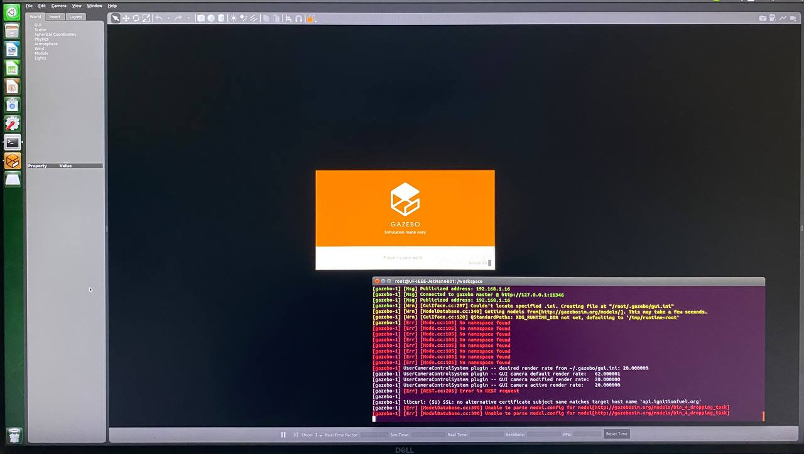

# SR-DEV-BOBERT

Create a ROS2-running robot powered by the Nvidia Jetson. Since the Jetson runs Ubuntu 18, use docker to accomplish this.

## State of Affairs
### Steps Taken [as of Alpha Build 1/21/22]:
- Create a [Dockerfile](./ROS2_Docker_Implementation/Dockerfile) to build a custom container to our specs.
- Test the docker container, try to start a Gazebo World. **Failure, detailed below.**
  ```
  cd bobert_custom
  docker/run.sh
  ros2 launch jetbot_ros gazebo_world.launch.py
  ```

### Issues Present [as of Alpha Build 1/21/22]:
- Though we can successfully build a ROS2 Foxy container with Gazebo and Python 3 Bindings for Gazebo, Gazebo ALWAYS hangs on launch: 
- We cannot escape the feeling that we are trying to stick a round peg into a square hole with trying to run ROS2 on the Jetson. 
  - **It might be time to fallback to ROS. - Luke, 1/17/22**


## Docker Tutorial
Tutorial link [here](https://www.youtube.com/watch?v=3c-iBn73dDE&t=6279s)
### Top Docker Commands:
```
docker –version
docker pull <image name>
docker run -it -d <image name>
docker ps
docker ps -a
docker exec -it <container id> bash
docker stop <container id>
docker kill <container id>
docker commit
docker login
docker push <username/image name>
docker images
docker rm <container id>
docker rmi <image-id>
docker build <path to docker file>
```

## ROS2 Commands
Tutorial link [here](https://www.youtube.com/watch?v=bFDfvKctvV8&list=PLRE44FoOoKf7NzWwxt3W2taZ7BiWyfhCp&index=1).

[View Installed Packages:](https://www.youtube.com/watch?v=X3Cmtg3Tq3Y&list=PLRE44FoOoKf7NzWwxt3W2taZ7BiWyfhCp&index=2)
```
ros2 pkg list
ros2 pkg executables <package_name>
```

[Package Creation, Sourcing, and Running:](https://www.youtube.com/watch?v=lN4_-l7FCWk&list=PLRE44FoOoKf7NzWwxt3W2taZ7BiWyfhCp&index=3)
```
colcon build
source install/setup.bash
ros2 pkg create --built-type ament_cmake <package_name>
ros2 pkg create --build-type ament_python <package_name>
ros2 run <package_name> <executable_name>
```

[Ros2 Executables and Nodes:](https://www.youtube.com/watch?v=aeOS9xqblrg&list=PLRE44FoOoKf7NzWwxt3W2taZ7BiWyfhCp&index=4)
```
ros2 pkg executables <package_name>
ros2 run <package_name> <executable_name>
ros2 node list
ros2 node info <node_name>
```
[Understanding ROS2 Topics](https://www.youtube.com/watch?v=-7my-IDnFwo&list=PLRE44FoOoKf7NzWwxt3W2taZ7BiWyfhCp&index=5)
```
ros2 run <package_name> <executable_name>
ros2 node list
ros2 node info <node_name>
ros2 interface proto <type>
ros2 topic pub -1 <topic_name> <massage_type> [values]
ros2 topic pub -r [publishing_rate(Hz)] <topic_name> <message_type> [values]
ros2 topic list
ros2 topic list -t
ros2 topic echo <topic_name>
ros2 topic info <topic_name>
ros2 topic hz <topic_name>
```
[Understanding ROS2 Services](https://www.youtube.com/watch?v=uYW8UJZTuAg&list=PLRE44FoOoKf7NzWwxt3W2taZ7BiWyfhCp&index=6)
```
TBF
```
